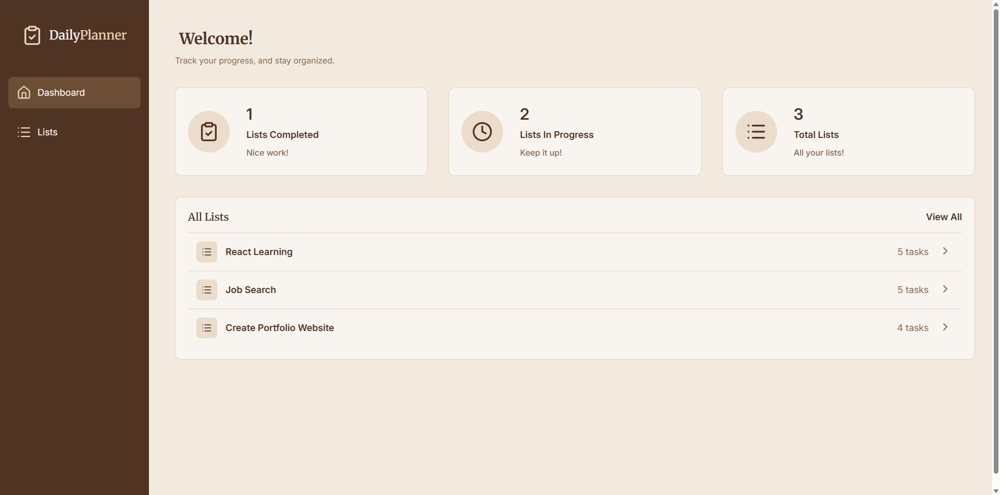
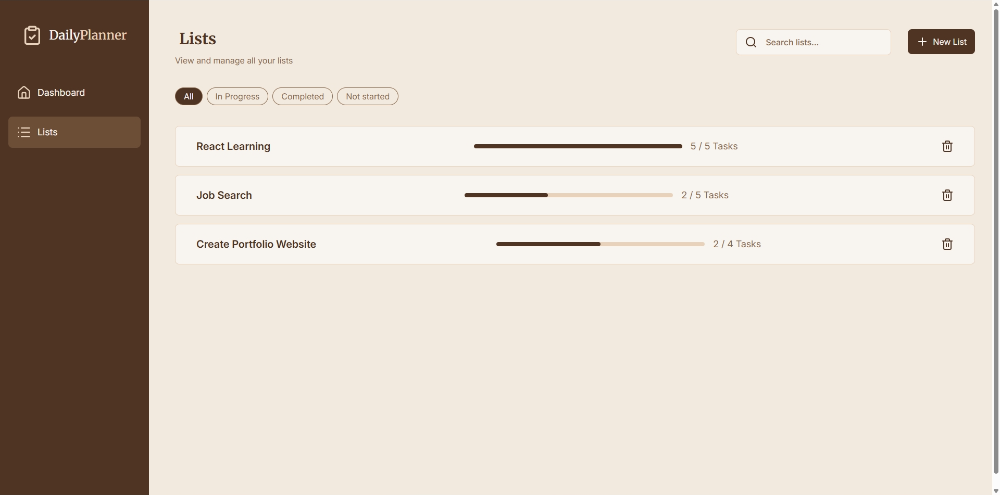
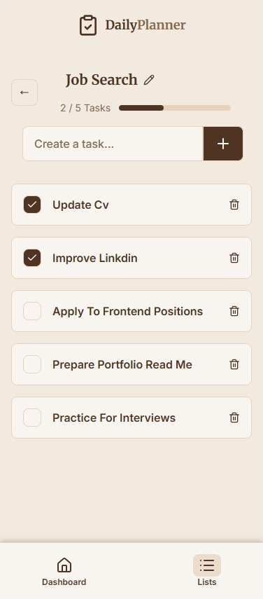

# Daily Planner
- Daily Planner is a responsive task management web application built with React and Tailwind CSS. It allows users to organize tasks into multiple lists, track their progress, and save their data locally using the browser's localStorage.

## Screenshots

## Live Demo
    https://daily-planner-kfb1.vercel.app/

## Features
- Create multiple lists
- Rename lists
- Delete lists
- Add and remove tasks
- Mark tasks as completed
- Progress bar for each list
- Search for lists
- Filter lists
- Dashboard statistics (lists completed, lists in progress, total lists)
- Responsive design
- Data saved with localStorage

## Built With
- React
- React Router
- Tailwind CSS
- JavaScript
- Vite
- LocalStorage
- Lucide React Icons

## Author
- GitHub: [Salima-Laidi] (https://github.com/Salima-Laidi)